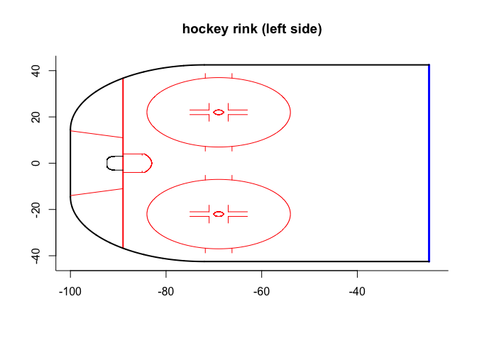
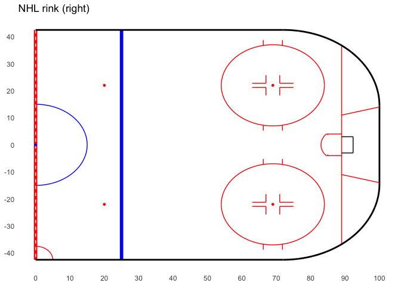
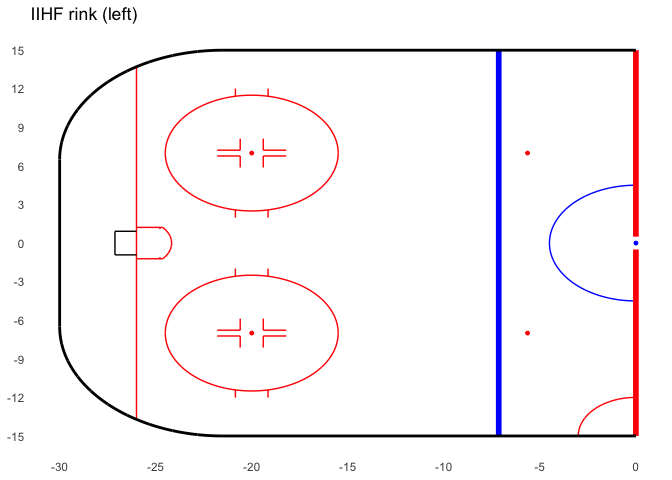
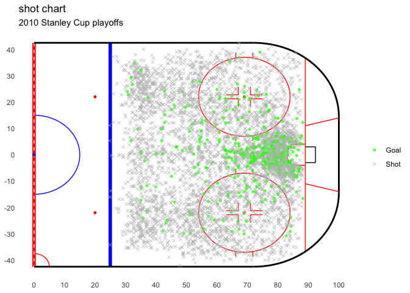
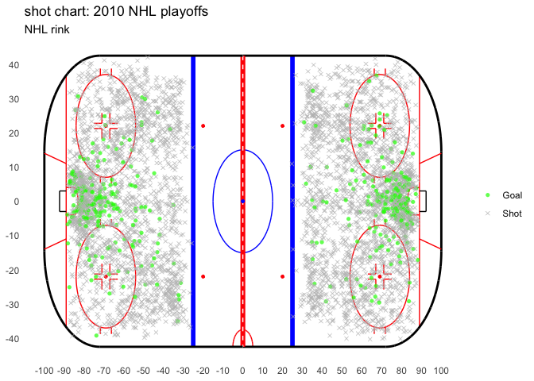
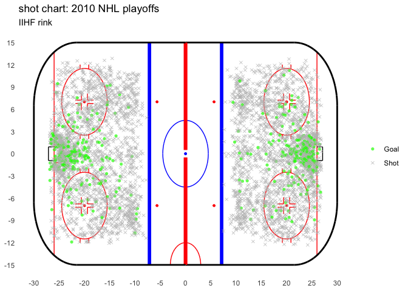

# Plotting a hockey rink with R

These are two scripts I wrote to plot a hockey rink in R, as detailed
[here](https://www.statswithmatt.com/post/hockey-with-r/). Both assume
that the corresponding data coordinates are relative to the center dot
at (0,0).

## base R plot

`hockey-rink.R` is for base R graphics to draw a rink with the standard
200ftx85ft NHL dimensions. It contains the functions `draw_rink()` and
`plot_rink()`; the former doing the work to draw the lines and the
latter being a wrapper around the default `plot()`. Each function also
has an argument `side` to specify if the `"right"` (from `x =
[25, 100]`; default) or `"left"` offensive zone is to be plotted.
`draw_rink()` can be called separately on an existing plot if desired.
The plots in the post were created with these functions.

``` r
source(here::here("hockey-with-r", "hockey-rink.R"))
plot_rink(x = 0, y = 0, side = "left", type = "n", bty = "l",
          xlab = NA, ylab = NA, main = "hockey rink (left side)")
```

<!-- -->

I’m sure the implementation here could stand to be more elegant, but I
have a limited amount of time to spend re-writing bad code from
something I did years ago.

## ggplot2

`gg-rink.R` uses ggplot2’s `annotate` to do the same as the above. The
lone function, `gg_rink()`, plots either the right (default) or left
*half* of the rink. Along with `side = c("right", "left")`, there is an
additional argument `specs` to plot a rink with either North American
(`"nhl"`; default) or international/Olympic (`"iihf"`) dimensions. I
recommended calling `gg_rink()` prior to using `geom_point()` or
whatever for the actual data so that the plot lines/annotations don’t
cover the data.

Note: All units are in feet for the NHL rink and in meters for the IIHF
rink.

``` r
library(ggplot2)
source(here::here("hockey-with-r", "gg-rink.R"))

# NHL rink
ggplot() +
  gg_rink() +
  scale_x_continuous(breaks = seq(0, 100, by = 10)) +
  scale_y_continuous(breaks = seq(-40, 40, by = 10)) +
  labs(title = "NHL rink (right)",
       x = NULL,
       y = NULL)
```

<!-- -->

``` r
# IIHF rink, left side
ggplot() +
  gg_rink(side = "left", specs = "iihf") +
  scale_x_continuous(breaks = seq(-30, 0, by = 5)) +
  scale_y_continuous(breaks = seq(-15, 15, by = 3)) +
  labs(title = "IIHF rink (left)",
       x = NULL,
       y = NULL)
```

<!-- -->

## Data example

The file `scf2010.rds` contains data for shots on goal during the 2010
Stanley Cup playoffs. The columns `xcoord, ycoord` are the original
(x,y) coordinates relative to center ice (0,0), with `x2, y2` mapping
the data to the same zone (`xcoord > 0`) for plotting purposes. Also
included are player name, team ID, play description, period, and
strength (coded as `701, 702, 703` for even-strength, power play, and
short-handed, if I remember correctly).

``` r
library(dplyr)
# 
# Attaching package: 'dplyr'
# The following objects are masked from 'package:stats':
# 
#     filter, lag
# The following objects are masked from 'package:base':
# 
#     intersect, setdiff, setequal, union
scf2010 <- readRDS(here::here("hockey-with-r", "scf2010.rds"))
shots <- scf2010 %>%
  # remove shots below goal line
  dplyr::filter(abs(xcoord) < 89)

ggplot(shots, aes(x = x2, y = y2)) +
  gg_rink(side = "right") +
  geom_point(aes(color = result, shape = result),
             position = "jitter", size = 1.5, alpha = 0.7) +
  labs(title = "shot chart",
       subtitle = "2010 Stanley Cup playoffs",
       x = NULL,
       y = NULL) +
  scale_color_manual(values = c("Shot" = "gray", "Goal" = "green"),
                     name = NULL) +
  scale_shape_manual(values = c("Shot" = 4, "Goal" = 16),
                     name = NULL) +
  scale_x_continuous(breaks = seq(0, 100, by = 10)) +
  scale_y_continuous(breaks = seq(-40, 40, by = 10))
```

<!-- -->

Actually, now that I’m thinking about it, I suppose there’s no reason
you can’t just call `gg_rink()` twice to get the whole rink if you want:

``` r
# using "right" and "left" together plots full rink
ggplot(shots, aes(x = xcoord, y = ycoord)) +
  gg_rink(side = "right") +
  gg_rink(side = "left") +
  geom_point(aes(color = result, shape = result),
             position = "jitter", size = 1.5, alpha = 0.7) +
  labs(title = "shot chart: 2010 NHL playoffs",
       subtitle = "NHL rink",
       x = NULL,
       y = NULL) +
  scale_color_manual(values = c("Shot" = "gray", "Goal" = "green"),
                     name = NULL) +
  scale_shape_manual(values = c("Shot" = 4, "Goal" = 16),
                     name = NULL) +
  scale_x_continuous(breaks = seq(-100, 100, by = 10)) +
  scale_y_continuous(breaks = seq(-40, 40, by = 10))
```

<!-- -->

``` r
# international rink
# convert data coordinates to meters
ggplot(shots, aes(x = xcoord/3.281, y = ycoord/3.281)) +
  gg_rink(side = "right", specs = "iihf") +
  gg_rink(side = "left", specs = "iihf") +
  geom_point(aes(color = result, shape = result),
             position = "jitter", size = 1.5, alpha = 0.7) +
  labs(title = "shot chart: 2010 NHL playoffs",
       subtitle = "IIHF rink",
       x = NULL,
       y = NULL) +
  scale_color_manual(values = c("Shot" = "gray", "Goal" = "green"),
                     name = NULL) +
  scale_shape_manual(values = c("Shot" = 4, "Goal" = 16),
                     name = NULL) +
  scale_x_continuous(breaks = seq(-30, 30, by = 5)) +
  scale_y_continuous(breaks = seq(-15, 15, by = 3))
```

<!-- -->
